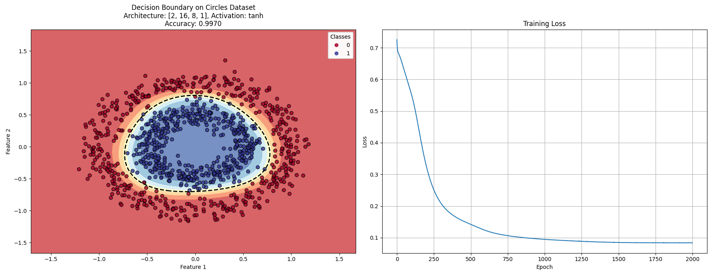
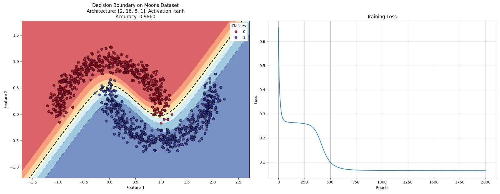
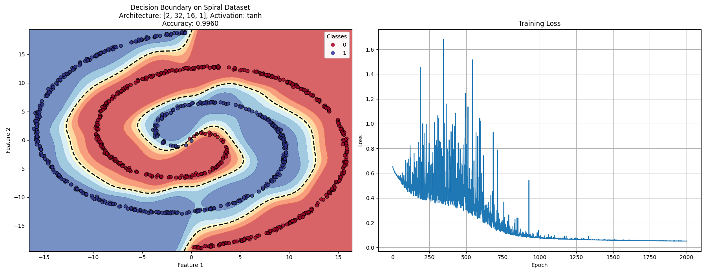
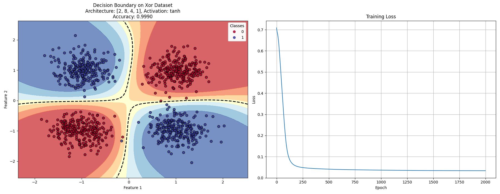
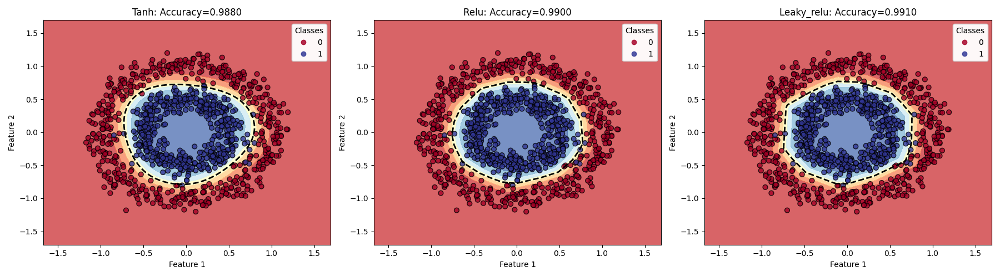

# Neural Networks from Scratch

This project implements neural networks from scratch for classifying data with non-linear decision boundaries.

## Description

A pure NumPy implementation of neural networks that can learn complex non-linear decision boundaries. The implementation includes:

- Flexible multi-layer neural network architecture
- Multiple activation functions (tanh, ReLU, Leaky ReLU)
- Mini-batch gradient descent with L2 regularization
- Support for different datasets with non-linear boundaries
- Visualization of decision boundaries and training progress

## Results

The neural network can successfully learn complex non-linear decision boundaries for various datasets:

### Circles Dataset


### Moons Dataset


### Spiral Dataset


### XOR Dataset


## Activation Function Comparison

Different activation functions can affect the model's ability to learn non-linear boundaries:



## Project Structure

- `neural_network.py`: Core neural network implementation
- `data_generator.py`: Synthetic dataset generators
- `train_model.py`: Training and evaluation code
- `visualize_results.py`: Visualization utilities

## How to Run

To train the model and generate visualizations:

```bash
# Install dependencies
pip install numpy matplotlib

# Run the training script
python train_model.py
```

## Implementation Details

This implementation features:

1. **Enhanced Initialization**: Xavier/Glorot initialization for better convergence
2. **Mini-batch Training**: More efficient than full-batch gradient descent
3. **Regularization**: L2 regularization to prevent overfitting
4. **Multiple Activation Functions**: Non-linear functions enable complex decision boundaries
5. **Numerical Stability**: Techniques to avoid overflow/underflow in calculations

## Future Improvements

- Add momentum and adaptive learning rates
- Implement dropout regularization
- Add batch normalization
- Support for more complex architectures

## License

This project is licensed under the MIT License - see the [LICENSE](LICENSE) file for details.
