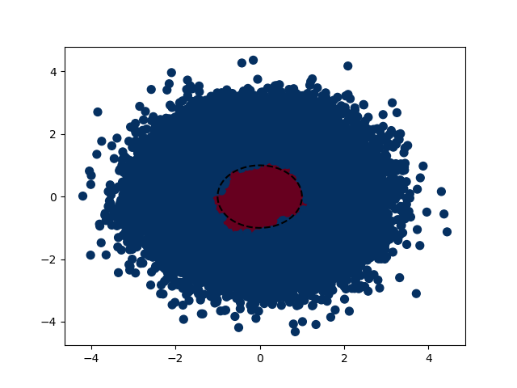
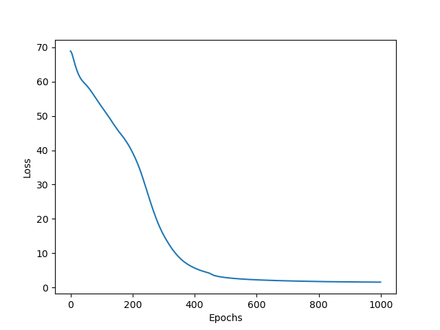
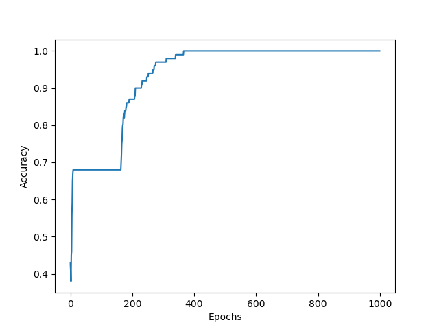
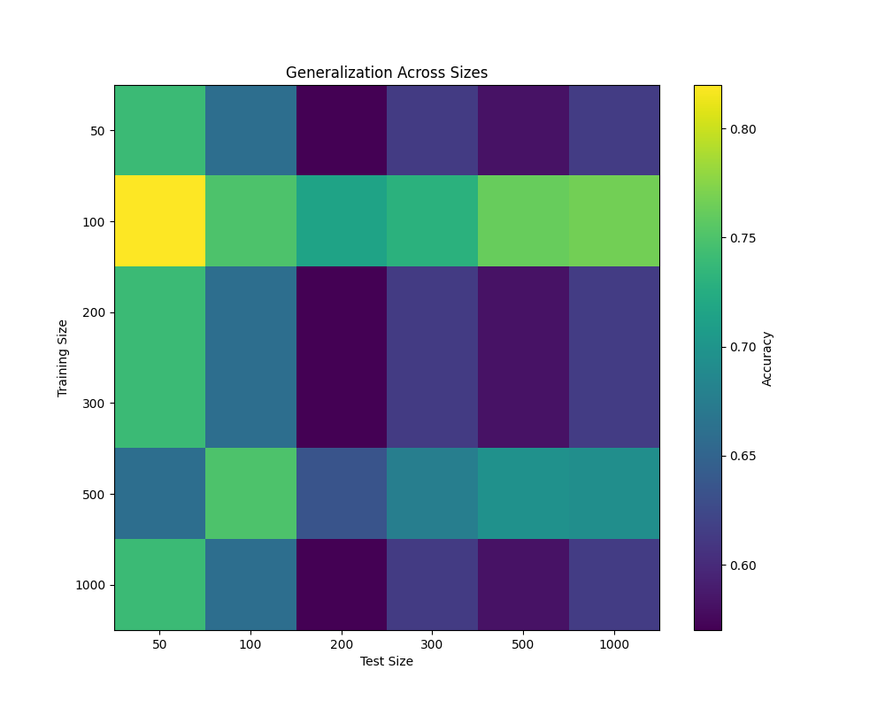
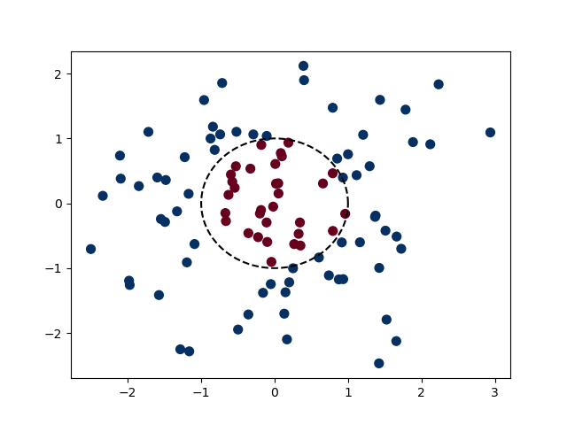

# NNfromScratch

This is a pure NumPy implementation of a Neural Network designed to identify non-linear decision boundaries. The project demonstrates how to build a neural network from the ground up without using any deep learning frameworks, showcasing the fundamental concepts of neural networks.

## Overview

The neural network is implemented with the following features:
- Built entirely using NumPy
- Capable of identifying non-linear decision boundaries
- Implements forward and backward propagation
- Uses ReLU and Sigmoid activation functions
- Includes momentum-based optimization
- Implements weight decay for regularization
- Uses Binary Cross-Entropy loss function

## Architecture

The network uses a 5-layer architecture:
1. Input Layer (2 neurons)
2. Hidden Layer 1 (6 neurons, ReLU)
3. Hidden Layer 2 (3 neurons, ReLU)
4. Hidden Layer 3 (10 neurons, ReLU)
5. Hidden Layer 4 (4 neurons, ReLU)
6. Output Layer (1 neuron, Sigmoid)

## Results

### Decision Boundary

The decision boundary learned by the neural network, showing its ability to separate non-linear patterns in the data.

### Training Progress

The training loss over epochs, demonstrating the network's convergence.

The accuracy metrics during training, showing the model's learning progress.

### Generalization Performance

A heatmap showing how well the model generalizes across different training and test set sizes.

### Data Distribution

Visualization of the training data distribution used to train the network.

## Features

### Training
- Learning rate: 0.005
- Momentum: 0.9
- Weight decay: 0.0001
- Epochs: 1000

### Activation Functions
- ReLU for hidden layers
- Sigmoid for output layer

### Loss Function
- Binary Cross-Entropy with epsilon smoothing

## Implementation Details

The implementation includes:
- Vectorized operations for efficient computation
- Momentum-based gradient descent optimization
- Weight initialization using Xavier/Glorot initialization
- Modular architecture design for easy modification
- Comprehensive evaluation across different dataset sizes

## License

This project is licensed under the MIT License - see the [LICENSE](LICENSE) file for details.
